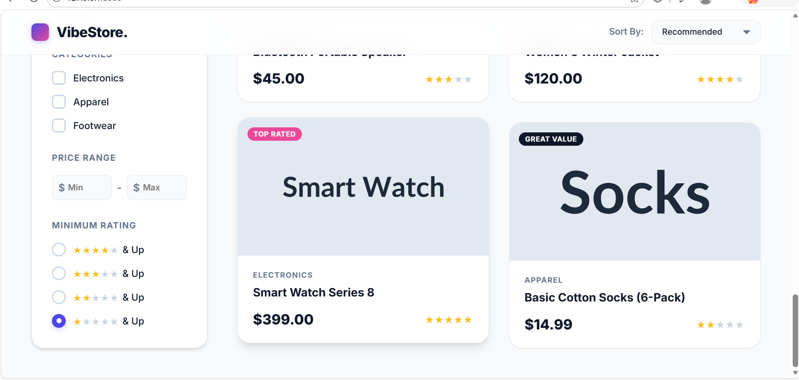

# VibeStore - E-Commerce Multi-Filter Sidebar

An advanced, high-traffic e-commerce browsing interface featuring instant state feedback and server-side combinatorial filtering. Built as a part of a 90-minute coding assessment.



## 🚀 Features

- **Instant State Feedback**: UI updates instantly via `fetch` API without needing a submit button.
- **Server-Side Filtering**: Core business logic (Combinatorial Intersect Filtering Array) is strictly implemented on the backend.
- **Graceful Null Handling**: Automatically bypasses filters if none are selected.
- **Sorting Algorithm**: Supports sorting by Price (Low/High) and Top Rated.
- **Data Engineering Best Practices**: Uses Pydantic for data validation and SQLite for robust data storage.
- **Premium UI/UX**: Features skeleton loading animations, dynamic product badges, and a custom light glassmorphism theme.

## 🛠️ Technology Stack

- **Backend**: Python, FastAPI, Uvicorn, SQLite
- **Validation**: Pydantic
- **Frontend**: Vanilla HTML5, CSS3, JavaScript
- **Testing**: Pytest

## 📦 Project Structure

```text
vibe_assessment/
├── backend/
│   ├── main.py          # FastAPI Router (Controller)
│   ├── services.py      # Business Logic (Combinatorial Filtering)
│   ├── schemas.py       # Pydantic Data Validation
│   └── database.py      # SQLite Connection Manager
├── data/
│   ├── ecommerce.db     # SQLite Database
│   └── products.json    # Initial Seed Data
├── frontend/            # Vanilla UI Assets
├── scripts/
│   └── init_db.py       # Database initialization script
└── tests/
    └── test_api.py      # Automated Unit Tests
```

## ⚙️ How to Run Locally

1. **Clone the repository:**
   ```bash
   git clone https://github.com/abhishektayde15/vibe-ecommerce-assessment.git
   cd vibe-ecommerce-assessment
   ```

2. **Install dependencies:**
   ```bash
   pip install -r requirements.txt
   ```

3. **Initialize the Database:**
   *(Optional: The `ecommerce.db` is already tracked, but if you need to reset it)*
   ```bash
   python scripts/init_db.py
   ```

4. **Start the FastAPI Server:**
   ```bash
   uvicorn backend.main:app --reload
   ```

5. **View the Application:**
   Open your browser and navigate to: `http://127.0.0.1:8000`

## 🧪 Running Tests

To run the automated unit tests validating the filtering logic:
```bash
pytest tests/
```
